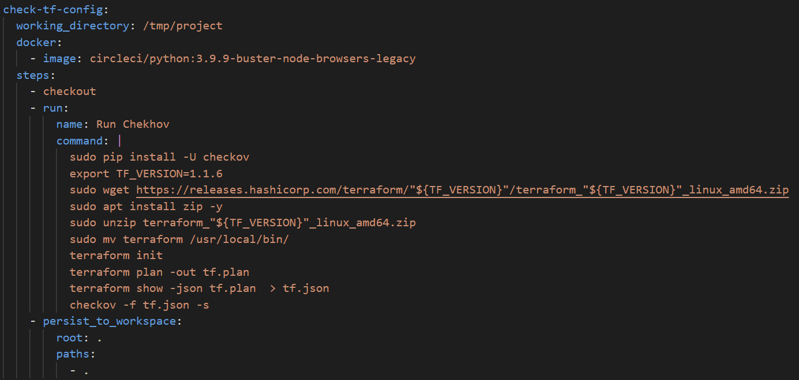
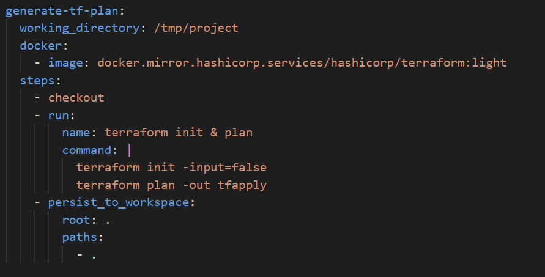
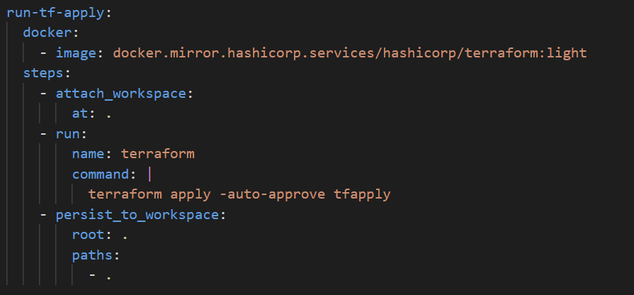
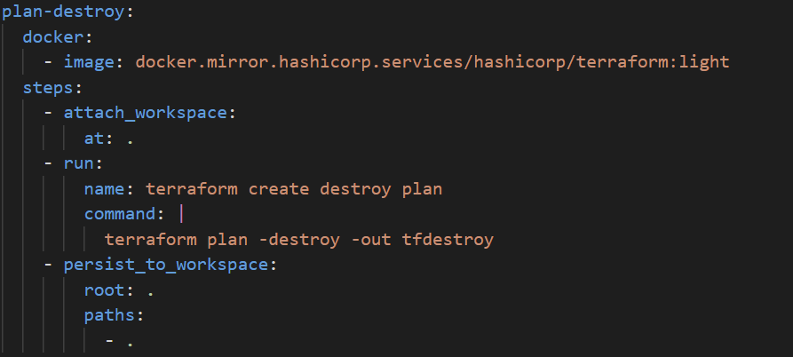
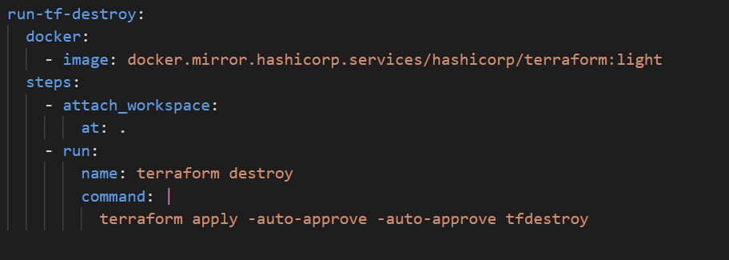
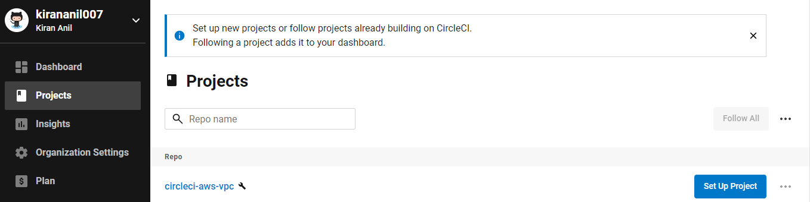
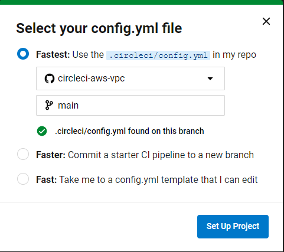
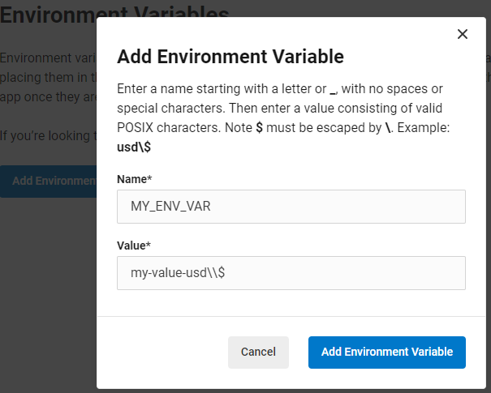
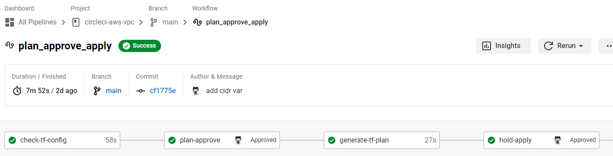
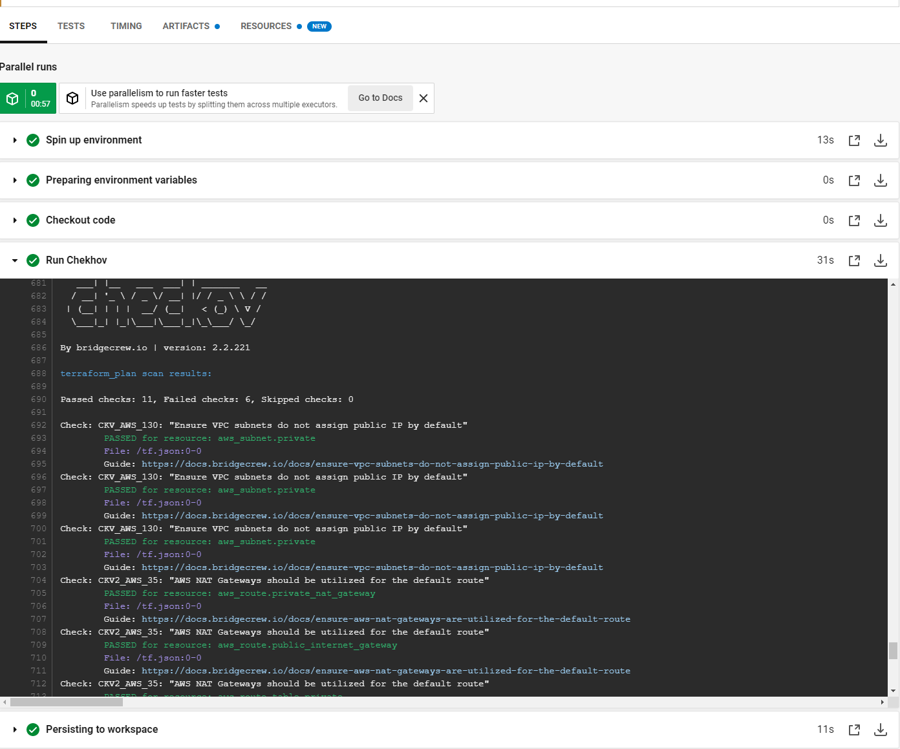

# Running Terraform to create AWS resources using Checkov and CircleCI

The pipeline illustrated integrates terraform configurations with Checkov scans which helps to find any misconfigurations before deployment. Checkov is a static analysis tool for finding IaC misconfigurations. It can be used for other tools such as helm charts, kubernetes, docker etc.

Terraform is a tool to manage the entire lifecycle of buiding, changing and versioning infrastructure. Terraform works with multiple cloud providers such as Amazon Web Services(AWS), Microsoft Azure, Google Cloud platforms as such or on-prem clouds such as OpenStack, vSphere etc. Hashicorp owns terraform and is open source.

CircleCI is a continuous integration/continuous delivery platform built by devops professionals to fine tune the development process. This enables development teams to build, test, approve and deploy changes in code with a dashboard UI. CircleCI requires a configuration file to define the tasks for the pipeline to run. 

Running terraform to create infrastruncture resources can be automated using CircleCI which takes care of:

- Checking terraform configuration using Checkov
- Approve and generate the terraform plan
- Approve and apply terraform configuration
- Approve and destroy the terraform created resources

### Requirements
---

1. AWS account
2. Github repository
3. CircleCI account


### Understanding the CircleCI pipeline
---

To run the terraform deployment, circleci requires a [.circleci/config.yaml](https://github.com/kirananil007/circleci-aws-vpc/blob/main/.circleci/config.yml) in the root directory of the project. The pipeline consists of sections ```jobs``` and ```workflows```. Job is a collection of steps comprising of bash commands run on docker containers which is the executor. The workflow incorporates these jobs into various blocks in the pipeline.

### Jobs
---
**a. check-tf-config**

This is the first step for running static code analysis scan runs on the terraform configuration using Checkov. It runs on a docker executor image ```circleci/python:3.9.9-buster-node-browsers-legacy```.



**b. generate-tf-plan**



**c. run-tf-apply**



**d. plan-destroy**



**e. run-tf-destroy**



### Sample Pipeline to create AWS VPC
---

The pipeline creates and deploys a VPC with public and private subnets in the AWS account across different availability zones. For more details, refer [here](https://github.com/kirananil007/circleci-aws-vpc/blob/main/main.tf).

1. Clone the repository.

    ``` git clone https://github.com/kirananil007/circleci-aws-vpc.git```

2. Connect circleci with the code repository.

    

3. Select the repository and branch.

    

4. Configure AWS credentials as environment variables in  the project settings of the pipeline.
   
   

5. Pipeline workflow 

    


6. Checkov scans in pipeline.

    

It is important to destroy the terraform created AWS resources. Please use the ```run-tf-destroy``` to tear down the infrastructure. Found [this](https://developer.hashicorp.com/terraform/tutorials/automation/circle-ci) tutorial useful for developing the pipeline with Checkov. 